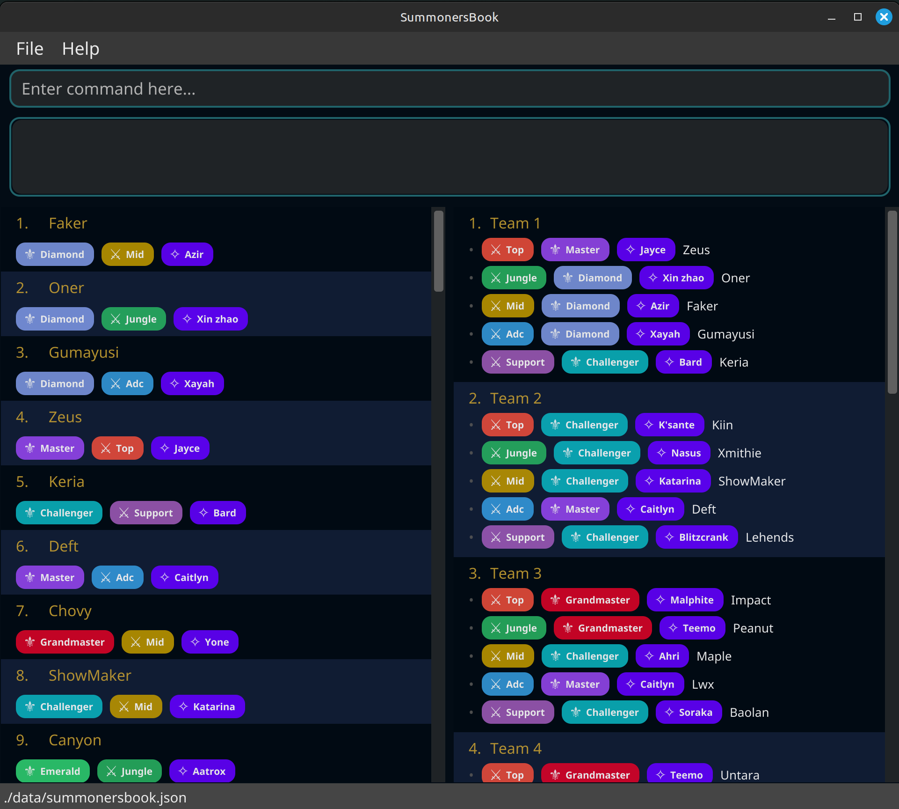

# SummonersBook User Guide

SummonersBook is a **desktop app for esports players (League of Legends)**, optimized for a fast **Command Line
Interface (CLI)** while still providing clear visual feedback via a Graphical User Interface (GUI). If you can type
fast, SummonersBook helps you manage players and form balanced teams faster than traditional GUI apps.

<!-- * Table of Contents -->
<page-nav-print />

--------------------------------------------------------------------------------------------------------------------

## Quick start

1. Ensure you have Java `17` or above installed in your Computer. 
   **Mac users:** Ensure you have the precise JDK version
   prescribed [here](https://se-education.org/guides/tutorials/javaInstallationMac.html).

2. Download the latest `summonersbook.jar` file from [here](https://github.com/AY2526S1-CS2103T-F08b-1/tp/releases).

3. Copy the file to the folder you want to use as the _home folder_ for your AddressBook.

4. Open a command terminal, `cd` into the folder you put the jar file in, and use the `java -jar addressbook.jar`
   command to run the application. 
   A GUI similar to the below should appear in a few seconds. Note how the app contains some sample data. 
   

5. Type the command in the command box and press Enter to execute it. e.g. typing **`help`** and pressing Enter will
   open the help window. 
   Some example commands you can try:

    * `add n/Faker rk/Grandmaster rl/ADC c/Sivir` — Adds a new player with a specified rank, role and champion.
    * `find rl/Support` — Filters the player list based on the role "Support".
    * `group` — Auto-creates balanced 5-player teams from unassigned players.
    * `viewteam 1` — Shows full details of the 1st team.
    * `exit` — Exits the app.

6. Refer to the [Features](#features) below for details of each command.

--------------------------------------------------------------------------------------------------------------------

## Features

**Notes about the command format:**

* Words in `UPPER_CASE` are the parameters to be supplied by the user. 
  e.g. in `add n/NAME rk/RANK rl/ROLE c/CHAMPION`, `NAME` , `RANK`, `ROLE`, `CHAMPION` are parameters which can be used
  as `add n/Faker rk/Grandmaster rl/ADC c/Sivir`.

* Parameters are _**case-insensitive**_

* Items in square brackets are optional. 
  e.g., `find [n/NAME] [rl/ROLE] [rk/RANK] [c/CHAMPION]` can be used as `find rk/Gold`.

* Items with `…` after them can be used multiple times including zero times. 
  e.g. `[t/TAG]…` can be used as ` ` (i.e. 0 times), `t/friend`, `t/friend t/family` etc.

* Parameters can be in any order. 
  e.g., for `add n/NAME rk/RANK rl/ROLE c/CHAMPION`, `add rk/RANK n/NAME rl/ROLE c/CHAMPION` is also acceptable.

* Extraneous parameters for commands that do not take in parameters (such as `help`, `exit`) will be ignored. 
  e.g. if the command specifies `help 123`, it will be interpreted as `help`.

* Indices refer to the **currently displayed** list (players or teams), starting from 1.

* If you are using a PDF version of this document, be careful when copying and pasting commands that span multiple lines
  as space characters surrounding line-breaks may be omitted when copied over to the application.

## SummonersBook commands

### Viewing help : `help`

A help window will appear, displaying our User Guide page.

Format: `help`

### Adding a player: `add`

Adds a new player with mandatory details.

Format:
`add n/NAME rk/RANK rl/ROLE c/CHAMPION`

Examples:

* `add n/Faker rk/Grandmaster rl/ADC c/Sivir`
* `add n/Imissher rk/Gold rl/Support c/Thresh`

### Listing all persons : `list`

Shows a list of all players in the Summonersbook.

Format: `list`

### Listing all teams : `listteam`

Shows a list of all teams in SummonersBook.

Format: `listteam`

### Deleting a player: `delete`

Removes a player permanently.

Format:
`delete INDEX`

* Deletes the person at the specified `INDEX`.
* The index refers to the index number shown in the displayed person list.
* The index **must be a positive integer** 1, 2, 3, …

Example:
`delete 3`

Success output:
`Deleted Player: <NAME>.`

Failure outputs (examples):

- `The player index provided is invalid.`
- `Cannot delete player. <NAME> is currently on team '<TEAM NAME>'.`
  (Remove from team before deleting.)

### Finding players by keyword : `find`

Searches for players by **keyword(s)** in their **name**.
If multiple keywords are given, players with at least 1 keyword in their name will be shown.
Matching is **case-insensitive** and based on **whole words only** (not partial matches!).

**Format:**
`find KEYWORD [MORE_KEYWORDS...]`

#### Examples
- `find joanne lim` — finds **Joanne Koh**, **Joanne Lim**, and **June Lim**, but **not** **John Kim**.
- `find john` — finds **John Doe** and **John Smith**.
- `find jo` — finds **Jo Lin**, but **not** “John Doe” or “John Smith”.

### Filtering players : `filter`

Narrows the player list using one or more filters.  
Matching is **case-insensitive**.

You can filter by:
- `rl/` — role (exact match)
- `rk/` — rank (exact match)

**Format (any order, at least one filter):**
`filter [rl/ROLE ...] [rk/RANK ...]`

#### How filtering works
- Filters of **different types** (e.g. `rl/` and `rk/`) are combined with **AND**.
- Filters **within the same type** (e.g. multiple `rl/` values) are combined with **OR**.
- Matching is **case-insensitive** and **exact**

#### Examples
- `filter rl/Mid Jungle` — players who are **Mid OR Jungle**.
- `filter rl/Mid rk/Gold` — players who are **Mid AND Gold**.
- `filter rl/Mid rl/Jungle rk/Gold rk/Silver` — players who are **(Mid OR Jungle) AND (Gold OR Silver)**.

### Editing a player : `edit`

Edits an existing player in your roster.

**Format:**
`edit INDEX [n/NAME] [rl/ROLE] [rk/RANK] [c/CHAMPION] [t/TAG]`

#### Notes
* `INDEX` refers to the number shown in the current displayed player list. Must be a positive integer (1, 2, 3…).
* At least one field to edit must be provided.
* Existing values are **overwritten** by the new input.
* Tags are **replaced**, not added. To clear all tags, type `t/` with no tag values.
* **Players that have already been added to a team cannot be edited.**

#### Examples
* `edit 1 n/John Doe rl/Mid rk/Diamond c/Ahri`  
  Updates the 1st player’s name, role, rank, and champion.

* `edit 2 t/`  
  Clears all tags of the 2nd player.

* `edit 3 rl/Top rk/Gold`  
  Updates the 3rd player’s role and rank.

### Auto-grouping players into teams: `group` (WIP)

Forms as many balanced teams of five as possible from **unassigned** players.
Format:
`group`

#### How it works
* Only players **not already in a team** are considered.
* The system ensures that each team has **no conflicting roles** (each role appears at most once per team).
* Players are grouped to create teams with **similar ranks** whenever possible, balancing skill across teams.
* Teams are automatically created until there are fewer than five unassigned players remaining.

### Manually creating a team: `makegroup`

Creates a new team with the specified players.

**Format:**  
`makegroup n/PLAYER_1 n/PLAYER_2 n/PLAYER_3 n/PLAYER_4 n/PLAYER_5`

#### Rules & Notes
- Each player must **already exist** in the player list.
- Players **cannot already belong** to another team.
- All five players must have **unique roles** (no duplicates).
- If any player name is invalid or unavailable, the command will fail with a clear error message.

#### Examples
- `makegroup n/Faker n/Oner n/Zeus n/Gumayusi n/Keria`  
Creates a new team with those five members.

### Disbanding a team or all teams : `ungroup`

Disbands one team (returns its players to the unassigned pool) or disbands all teams.

Format:
`ungroup TEAM_INDEX` OR `ungroup all` ('all' is case-insensitive)

Examples:

- `ungroup 1` — disbands the 1st team
- `ungroup all` — disbands all teams

### Add new performance record to a player : `addStats`

Add a new set of values to a player's Stats:
- Creep score per minute (CPM)
- Gold difference at 15th minute (GD15)
- Kill/Death/Assist score (KDA)

**Format:**
`addStats INDEX cpm/CPM gd15/GD15 kda/KDA`

#### Notes
* `INDEX` refers to the number shown in the current displayed player list. Must be a positive integer (1, 2, 3…).
* All fields must be provided.
* CPM and KDA can be decimals or integers e.g., `cpm/9.8`, `kda/2`
* Decimal point is a dot `.`
* GD15 must be an integer in the ranger e.g, `gd15/560`
* These values will be recorded in one's Stats and their average score will be updated accordingly.

#### Examples
- `addStats 1 cpm/8.8 kda/6.0 gd15/2000`
  Add the performance values for the latest match of the first player in the list to their Stats.

### Remove the most recent performance record of a player : `deleteStats`

Delete the most recent set of values of a player's Stats:
- Creep score per minute (CPM)
- Gold difference at 15th minute (GD15)
- Kill/Death/Assist score (KDA)

**Format:**
`deleteStats INDEX`

#### Notes
* `INDEX` refers to the number shown in the current displayed player list. Must be a positive integer (1, 2, 3…).
* The most recent set of performance values (cpm, gd15, kda) will be deleted in one's Stats
  and their average score will be updated accordingly.

#### Examples
- `deleteStats 1`
  delete the most recent set of performance values of the first player in the list.

### Clearing all entries : `clear`

Clears all entries from the address book.

Format: `clear`

### Exiting the program : `exit`

Closes the application.
Format: `exit`

### Saving the data

Data is saved automatically to disk after any command that changes data. No manual save is required.

### Editing the data file

SummonersBook data is saved automatically as a JSON file located at `[JAR file location]/data/addressbook.json`.  
Advanced users can edit this file directly if needed.

**Caution:**  
Editing the data file incorrectly can **corrupt your data**, causing SummonersBook to start with an empty file.  
Always **back up the file** before making changes, and only edit it if you are confident about the updates.

--------------------------------------------------------------------------------------------------------------------

## FAQ

**Q**: How do I transfer my data to another Computer? 
**A**: Install the app in the other computer and overwrite the empty data file it creates with the file that contains
the data of your previous AddressBook home folder.

**Q:** Why can’t I delete a player who’s on a team?
**A:** Team rosters must always have 5 players. Remove the player from their team (via `editteam` in future versions or
`ungroup` and re-group) before deleting.

**Q:** How are teams named when using `group`?
**A:** Sequentially (`Team A`, `Team B`, …), skipping any existing names to avoid conflicts.

--------------------------------------------------------------------------------------------------------------------

## Known issues

1. **When using multiple screens**, if you move the application to a secondary screen, and later switch to using only
   the primary screen, the GUI will open off-screen. The remedy is to delete the `preferences.json` file created by the
   application before running the application again.
2. **If you minimize the Help Window** and then run the `help` command (or use the `Help` menu, or the keyboard shortcut
   `F1`) again, the original Help Window will remain minimized, and no new Help Window will appear. The remedy is to
   manually restore the minimized Help Window.

--------------------------------------------------------------------------------------------------------------------

## Command summary - SummonersBook

Action               | Format
-------------------- | --------------------------------------------------
**Help**             | `help`
**Add player**       | `add n/NAME rk/RANK rl/ROLE c/CHAMPION`
**List all players** | `list`
**List all teams**   | `listteam`
**View player**      | `view INDEX`
**Delete player**    | `delete INDEX`
**Find players**     | `find KEYWORD [MORE_KEYWORDS...]`
**Filter players**   | `filter [rl/ROLE ...] [rk/RANK ...]`
**Edit player**      | `edit INDEX [n/NAME] [rl/ROLE] [rk/RANK] [c/CHAMPION] [t/TAG]`
**Auto-group teams** | `group`
**Manually create team** | `makegroup n/PLAYER_1 n/PLAYER_2 n/PLAYER_3 n/PLAYER_4 n/PLAYER_5`
**Ungroup teams**    | `ungroup TEAM_INDEX` · `ungroup all`
**Add performance values** | `addStats INDEX cpm/CPM gd15/GD15 kda/KDA`
**Delete performance values** | `deleteStats INDEX`
**Clear all entries**| `clear`
**Exit**             | `exit`
