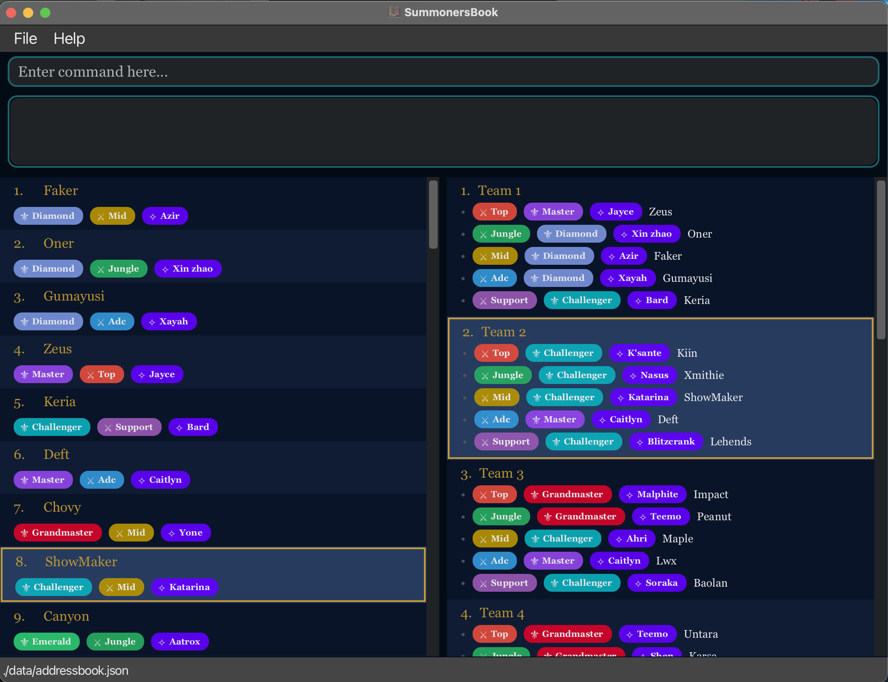

# SummonersBook User Guide

**Are you a League of Legends esports coach or team manager** spending hours juggling rosters, balancing skill levels, and tracking player performance across scrimmages?

SummonersBook is built specifically for you.

## What SummonersBook Does

Manage your player roster and form 5v5 teams **in seconds** instead of hours:
- **Auto-group teams** by rank, role, and champion pool
- **Track player performance** with built-in stats and visualizations
- **Fast keyboard commands** optimized for coaches who type quickly

If you're comfortable with typing commands (like using Slack or Discord), SummonersBook will be 3x faster than spreadsheets or traditional apps.

---
## Table of Contents

1. [Quick Start](#quick-start)
    - [Step 1: Install (One-Time Setup)](#step-1-install-one-time-setup)
    - [Step 2: Running SummonersBook](#step-2-running-summonersbook)
    - [Step 3: Your First Team (2-Minute Tutorial)](#step-3-your-first-team-2-minute-tutorial)
    - [Step 4: Learn the Essentials](#step-4-learn-the-essentials)
2. [Common Workflows](#common-workflows)
    - [Preparing for Scrimmage Night](#workflow-1-preparing-for-scrimmage-night)
    - [Finding Substitutes Mid-Tournament](#workflow-2-finding-substitutes-mid-tournament)
    - [Post-Match Performance Tracking](#workflow-3-post-match-performance-tracking)
3. [Feature Summary](#feature-summary)
    - [Player Management](#player-management)
    - [Performance Tracking](#performance-tracking)
    - [Team Management](#team-management)
    - [Data Import/Export](#data-importexport)
    - [Utility Commands](#utility-commands)
4. [Troubleshooting](#troubleshooting)
5. [FAQ](#faq)
6. [Known Issues](#known-issues)
7. [Glossary](#glossary)
8. [Command Summary](#command-summary)

---
## Quick Start

### Step 1: Install (One-Time Setup)

1. Ensure you have Java 17 or above installed on your computer.<br>
    - You can check your version by opening a terminal or command prompt and running: java -version
        - If Java is not installed or the version is older than 17:
          Mac users: Follow [this Mac-specific guide](https://se-education.org/guides/tutorials/javaInstallationMac.html) for installation.
          Windows/Linux: Download and install the latest Java Development Kit (JDK) from [Oracle's website](https://www.oracle.com/java/technologies/downloads/)

2. Download the latest version of SummonersBook from our [official website](https://github.com/AY2526S1-CS2103T-F08b-1/tp/releases).
    - Download the latest `summonersbook.jar` file available.

3. Place the file in a folder you want to use as the home folder for SummonersBook.
    - For convenience, you can create a new folder on your Desktop and place `summonersbook.jar` file in the new folder.

---
### Step 2: Running SummonersBook
1. Open a terminal or command prompt:

    - Windows: Press `Win + R`, type `cmd`, and hit `Enter`.
    - Mac/Linux: Open the Terminal app. You can find the Terminal app in `Finder -> Application -> Utilities`

2. Navigate to the folder where you placed the `summonersbook.jar` file. For example:
    - `cd /path/to/your/folder`

3. Run the application by entering this command in your terminal: `java -jar summonersbook.jar`

4. After a few seconds, the SummonersBook window will appear with some sample data.
    - You can clear the sample data before adding your own, as it will not be automatically overwritten.

The SummonersBook window should look like the image below:


### Step 3: Your First Team (2-Minute Tutorial)

Let's form your first balanced team to see SummonersBook in action!

**a) Add 5 players** (copy-paste these one-by-one into the command box):

1. `add n/Faker rk/Grandmaster rl/Mid c/Azir`
2. `add n/Zeus rk/Diamond rl/Top c/Gnar`
3. `add n/Oner rk/Master rl/Jungle c/Lee Sin`
4. `add n/Gumayusi rk/Challenger rl/ADC c/Aphelios`
5. `add n/Keria rk/Master rl/Support c/Thresh`

**b) Auto-create a balanced team:**

```
group
```

🎉 **Done!** You just formed a balanced team in under 30 seconds. The team will appear in the team panel on the right.

### Step 4: Learn the Essentials

Now that you've seen the magic, explore these core commands:
- `filter rl/Mid rk/Diamond` — Find specific players by role and rank
- `view 1` — Check detailed player stats and performance trends
- `help` — Open the full command reference guide

Refer to the [Features](#features) section below for complete details on all commands.

[Back to Top](#summonersbook-user-guide)

---

## Common Workflows

These workflows show you how to accomplish typical coaching tasks with SummonersBook.

### Workflow 1: Preparing for Scrimmage Night

**Your goal:** You have 15 players and need to form 3 balanced teams for practice matches.

**Steps:**

1. **Add your players** (if not already in the system):
   ```
   add n/Faker rk/Grandmaster rl/Mid c/Azir
   add n/Zeus rk/Diamond rl/Top c/Renekton
   add n/ShowMaker rk/Master rl/Mid c/Syndra
   ... (continue adding remaining players)
   ```

2. **Auto-create balanced teams:**
   ```
   group
   ```
   → SummonersBook instantly creates up to 3 rank-ordered teams, ensuring unique roles and champions per team.
   → Teams appear automatically in the team panel on the right side of the window.

**Time saved:** ~45 minutes compared to manual balancing in spreadsheets.

### Workflow 2: Finding Substitutes Mid-Tournament

**Your goal:** Your support player is unavailable. Find high-rank support substitutes quickly.

**Steps:**

1. **Filter by role and rank:**
   ```
   filter rl/Support rk/Diamond rk/Master
   ```
   → Shows only Diamond and Master ranked Support players.

2. **Check detailed stats for the top candidate:**
   ```
   view 1
   ```
   → Opens performance window showing KDA, CS/min, win rate, and recent form.

**Time saved:** ~10 minutes compared to manually scrolling through your entire roster.

### Workflow 3: Post-Match Performance Tracking

**Your goal:** Record player performance after a scrimmage to track improvement over time.

**Steps:**

1. **Record a win or loss for a team:**
   ```
   win 1
   ```
   → Adds a win for the team and its players (use `lose 1` to add a loss).

2. **Add performance stats for a player:**
   ```
   addStats 5 cpm/8.2 gd15/450 kda/4.5
   ```
   → Records CS per minute (8.2), gold difference at 15 min (+450), and KDA (4.5).

3. **View performance trends:**
   ```
   view 5
   ```
   → Charts show improvement or decline over the last 10 matches.

**Insight:** Spot underperforming players or rising stars instantly with visual trends.

[Back to Top](#summonersbook-user-guide)

---

## Feature Summary

Click on any command to jump to its detailed explanation.

### Player Management

Command | Purpose | Format
--------|---------|-------
[`add`](#adding-a-player-add) | Add a new player to roster | `add n/NAME rk/RANK rl/ROLE c/CHAMPION [t/TAG ...]`
[`list`](#listing-all-players-list) | Show all players | `list`
[`find`](#finding-players-by-name-find) | Search players by name | `find KEYWORD [MORE_KEYWORDS...]`
[`filter`](#filtering-players-filter) | Filter by role/rank | `filter [rl/ROLE ...] [rk/RANK ...] [c/CHAMPION ...] [s/SCORE]`
[`view`](#viewing-detailed-player-information-view) | View detailed player stats | `view INDEX`
[`edit`](#editing-a-player-edit) | Update player details | `edit INDEX [n/NAME] [rl/ROLE] [rk/RANK] [c/CHAMPION] [t/TAG ...]`
[`delete`](#deleting-a-player-delete) | Remove a player | `delete INDEX`

### Performance Tracking

Command | Purpose                                 | Format
--------|-----------------------------------------|-------
[`addStats`](#adding-performance-stats-addstats) | Record match performance                | `addStats INDEX cpm/CPM gd15/GD15 kda/KDA`
[`deleteStats`](#removing-performance-stats-deletestats) | Remove latest stats entry               | `deleteStats INDEX`
[`win`](#recording-a-team-win-win) | Record a win for a team<br/> and its players | `win TEAM_INDEX`
[`lose`](#recording-a-team-loss-lose) | Record a loss for a team<br/> and its players | `lose TEAM_INDEX`

### Team Management

Command | Purpose | Format
--------|---------|-------
[`group`](#auto-grouping-players-into-teams-group) | Auto-create rank-ordered teams | `group`
[`makeGroup`](#manually-creating-a-team-makegroup) | Manually create a team | `makeGroup INDEX_1 INDEX_2 INDEX_3 INDEX_4 INDEX_5`
[`viewTeam`](#viewing-team-details-viewteam) | View detailed team stats | `viewteam INDEX`
[`ungroup`](#disbanding-teams-ungroup) | Disband team(s) | `ungroup INDEX` or `ungroup all`

### Data Import/Export

Command | Purpose | Format
--------|---------|-------
[`export`](#exporting-data-export) | Export players or teams to CSV | `export players or export teams [to PATH]`
[`import`](#importing-player-data-import) | Import players from CSV | `import players from PATH`

### Utility

Command | Purpose | Format
--------|---------|-------
[`help`](#viewing-help-help) | Open help window | `help`
[`clear`](#clearing-all-data-clear) | Delete all data | `clear`
[`exit`](#exiting-the-program-exit) | Close application | `exit`

[Back to Top](#summonersbook-user-guide)

---

## Features

**Notes about the command format:**

* Words in `UPPER_CASE` are the parameters to be supplied by the user.<br>
  e.g. in `add n/NAME rk/RANK rl/ROLE c/CHAMPION [t/TAG ...]`, `NAME` , `RANK`, `ROLE`, `CHAMPION` are parameters which can be used
  as `add n/Faker rk/Grandmaster rl/ADC c/Sivir`.

* Parameters are _**case-insensitive**_ (except for `name`)

* Items in square brackets are optional.<br>
  e.g., `filter [rl/ROLE] [rk/RANK] [c/CHAMPION] [s/SCORE]` can be used as `filter rk/Gold`.

* Items with `…` after them can be used multiple times including zero times.<br>
  e.g. `[t/TAG]…` can be used as ` ` (i.e. 0 times), `t/friend`, `t/friend t/family` etc.

* Parameters can be in any order.<br>
  e.g., for `add n/NAME rk/RANK rl/ROLE c/CHAMPION`, `add rk/RANK n/NAME rl/ROLE c/CHAMPION` is also acceptable.

* Extraneous parameters for commands that do not take in parameters (such as `help`, `exit`) will be ignored.<br>
  e.g. if the command specifies `help 123`, it will be interpreted as `help`.

* Indices refer to the **currently displayed** list (people or teams), starting from 1.

* If you are using a PDF version of this document, be careful when copying and pasting commands that span multiple lines
  as space characters surrounding line-breaks may be omitted when copied over to the application.

* As new LoL champions may be added in the future, you can find **all champions supported by SummonersBook** in the **Appendix**.

---

## Player Management

### Adding a player: `add`

Adds a new player with mandatory details to your roster.

**Format:**
```
add n/NAME rk/RANK rl/ROLE c/CHAMPION [t/TAG ...]
```

**Note:**
- `name` has to be **3-16 alphanumerical characters** with **no spaces allowed.** 
  - is treated as in-game displayed username rather than real names.
- Duplicate names are **not allowed**, an error message will be shown.
- `tag` can only be **up to 20 alphanumerical character**, with **no spaces allowed.**

**Examples:**

* Adds the player "Faker" with the rank Grandmaster, role ADC, and champion Sivir.
```
add n/Faker rk/Grandmaster rl/ADC c/Sivir
```
* Adds the player "Imissher" with the rank Gold, role Support, and champion Thresh.
```
add n/Imissher rk/Gold rl/Support c/Thresh
```

### Listing all players: `list`

Shows a list of all players in your SummonersBook roster.

**Format:** 
```
list
```
<box type="tip" seamless>

**Tip:** Use this command to reset any filters and see your full roster again.

</box>

### Finding players by name: `find`

Searches for players by **keyword(s)** in their **name**.
If multiple keywords are given, players with at least 1 keyword in their name will be shown.

**Format:**
```
find KEYWORD [MORE_KEYWORDS]...
```

**How it works:**
- Matching is **case-insensitive**
- Based on **whole words only** (not partial matches)
- OR logic: returns players matching ANY keyword

**Examples:**

* Finds **Joanne Koh**, **Joanne Lim**, and **June Lim**, but **not** **John Kim**.
```
find joanne lim
```
* Finds **John Doe** and **John Smith**.
```
find john
```
* Finds **Jo Lin**, but **not** "John Doe" or "John Smith" (whole word match).
```
find jo
```

### Filtering players: `filter`

Narrows the player list by using one or more filters.

You can filter by:
- `rl/` — role (exact match), can be used multiple times
- `rk/` — rank (exact match), can be used multiple times
- `c/` — champion (exact match), can be used multiple times
- `s/` — score (shows players with score rating greater or equal to the given value), supply it **only once**!
  - **We only accept up to 2 decimal places** (e.g. `3.4`, `7.89`), any inputs beyond 2 d.p. (e.g. `5.678`) will be rejected!
  - If more than 1 `s/SCORE` field is provided, an error message will appear.
  
**Format (any order, at least one filter):**
```
filter [rl/ROLE ...] [rk/RANK ...] [c/CHAMPION ...] [s/SCORE]
```

**How it works:**
- Filters of **different types** (e.g. `rl/` and `rk/`) are combined with **AND**.
- Filters **within the same type** (e.g. multiple `rl/` values) are combined with **OR**.
- Matching is **case-insensitive** and **exact**

**Examples:**
* Filters players who have roles **Mid** OR **Jungle**.
```
filter rl/Mid rl/Jungle
```
* Filters players who have role **Mid** AND rank **Gold**.
```
filter rl/Mid rk/Gold
```
• Filters players who have roles (**Mid** OR **Jungle**) AND ranks (**Gold** OR **Silver**).
```
filter rl/Mid rl/Jungle rk/Gold rk/Silver
```

### Viewing detailed player information: `view`

Opens a detailed window showing comprehensive information about a player, including their performance statistics visualized in graphs.

**Format:**
```
view INDEX
```

**How it works:**
* The window displays:
    - Basic information (name, role, rank, champion, tags)
    - Win/loss record
    - Performance score over time
    - CS per minute trends
    - KDA trends
    - Gold difference at 15 minutes trends
* Up to the latest 10 matches are shown in the performance graphs.

**Notes:**
* `INDEX` refers to the number shown in the current displayed player list. Must be a positive integer (1, 2, 3…)

**Examples:**
* Open a detailed window for the 1st player in the list
```
view 1
```
* Opens a detailed window for the 5th player in the list.
```
view 5
```

### Editing a player: `edit`

Updates an existing player's details in your roster.

**Format:**
```
edit INDEX [n/NAME] [rl/ROLE] [rk/RANK] [c/CHAMPION] [t/TAG]
```

**How it works:**
* Existing values are **overwritten** by the new input.
* Tags are **replaced**, not added. To clear all tags, type `t/` with no tag values.

**Notes:**
* `INDEX` refers to the number shown in the current displayed player list. Must be a positive integer (1, 2, 3…)
* At least one field to edit must be provided.

<box type="important" seamless>
**Important:** Editing a player that is in a team may not be allowed due to duplicate roles or champions. Remove them from the team first using `ungroup`

</box>

**Examples:**
* Updates name, role, rank, and champion of the 1st player in the list.
```
edit 1 n/John Doe rl/Mid rk/Diamond c/Ahri
```
* Clear all tags of the 2nd player in the list.
```
edit 2 t/
```
* Updates only the role and rank of the 3rd player in the list.
```
edit 3 rl/Top rk/Gold
```

### Deleting a player: `delete`

Removes a player permanently from your roster.

**Format:**
```
delete INDEX
```

**How it works:**
* Deletes the player at the specified `INDEX`.

**Notes:**
* `INDEX` refers to the number shown in the current displayed player list. Must be a positive integer (1, 2, 3…)

<box type="important" seamless>

**Important:** You cannot delete a player who is currently on a team. Remove them from the team first using `ungroup`.

</box>

**Example:**
* Delete the 3rd player in the list.
```
delete 3
```

[Back to Top](#summonersbook-user-guide)

---

## Performance Tracking

### Adding performance stats: `addStats`

Records a new set of performance values for a player after a match:
- Creep score per minute (CPM)
- Gold difference at 15th minute (GD15)
- Kill/Death/Assist score (KDA)

**Format:**
```
addStats INDEX cpm/CPM gd15/GD15 kda/KDA
```
**How it works:**
* A new set of performance values (cpm, gd15, kda) will be added.
* These values will be recorded and the player's average performance score will be updated automatically.

**Notes:**
* `INDEX` refers to the number shown in the current displayed player list. Must be a positive integer (1, 2, 3…).
* All fields must be provided.
* CPM must be a decimal between 0.0 and 40.0
* GD15 must be an integer between -10,000 and 10,000
* KDA must be a decimal between 0.0 and 200.0
* Decimal point is a dot `.`

**Example:**

* Records 8.8 CS per minute, +2000 gold lead at 15 min, and 6.0 KDA for the 1st player in list.
```
addStats 1 cpm/8.8 gd15/2000 kda/6
```

→ Player 1's overall performance score updates automatically.
→ View trends with `view 1`

### Removing performance stats: `deleteStats`

Deletes the most recent performance record for a player (useful for correcting mistakes).

**Format:**
`deleteStats INDEX`

**How it works:**
* The most recent set of performance values (cpm, gd15, kda) will be deleted.
* The player's average score will be recalculated automatically.

**Notes:**
* `INDEX` refers to the number shown in the current displayed player list. Must be a positive integer (1, 2, 3…).

**Example:**
* Removes the latest performance entry for the 1st player in the list.
```
deleteStats 1
```
---

### Recording a team win : `win`

Records a win for a team, updating both the team's record and all team members' individual records.

**Format:**
```
win TEAM_INDEX
```

**How it works:**
* The selected team will have its win count incremented.
* The team's members will also have their win counts incremented.

**Notes:**
* `TEAM_INDEX` refers to the number shown in the displayed team list. Must be a positive integer (1, 2, 3…).

> [!IMPORTANT]
> If a team is removed, all its recorded wins and losses are deleted.
> Even if you later create a new team with the same players, the previous team's win/loss record will **not** be restored.

<box type="important" seamless>

**Important:** If a team is removed, all its recorded wins and losses are deleted. Even if you later create a new team with the same players, the previous team's win/loss record will **not** be restored.

</box>

**Example:**
* Records a win for the 1st team in the list.
```
win 1
```
---

### Recording a team loss : `lose`

Records a loss for a team, updating both the team's record and all team members' individual records.

**Format:**
```
lose TEAM_INDEX
```

**How it works:**
* The selected team will have its loss count incremented.
* The team's members will also have their loss counts incremented.

**Notes:**
* `TEAM_INDEX` refers to the number shown in the displayed team list. Must be a positive integer (1, 2, 3…).

**Example:**
* Records a loss for the 2nd team in the list.
```
lose 2
```

[Back to Top](#summonersbook-user-guide)

---

## Team Management

### Auto-grouping players into teams: `group`

Automatically forms as many teams of five as possible from **unassigned** players using a rank-based matching algorithm.

**Format:**
```
group
```

**How it works:**

The algorithm follows these steps:
1. Groups all unassigned players by their roles (Top, Jungle, Mid, ADC, Support).
2. Sorts each role group by rank (highest to lowest).
3. Iteratively forms teams by selecting the highest-ranked available player from each role.
4. Ensures no duplicate champions within each team to avoid conflicts.
5. Continues creating teams until there are insufficient players to form a complete team.

**Note:** This creates rank-ordered teams where Team 1 contains the highest-ranked players, Team 2 contains the next-highest-ranked players, and so on.

**Notes:**
* At least one unassigned player for each of the five roles is required to form a team.
* Only players **not already in a team** are considered.
* If champion conflicts prevent forming a team, the algorithm stops and reports how many teams were created.
* Any remaining unassigned players stay in the pool and can be grouped later.

<box type="warning" seamless>

**Common Mistake:** Make sure you have at least 1 player per role (Top, Jungle, Mid, ADC, Support). The algorithm can't form teams with missing roles.

</box>

### Manually creating a team: `makeGroup`

Creates a new team with the specified players by their index numbers.

**Format:**
```
makeGroup INDEX_1 INDEX_2 INDEX_3 INDEX_4 INDEX_5
```

**How it works:**
* The selected players will be verified if they form a valid team.
* Once verified, the team is created and added to your team list.

**How it works:**
* The selected players will be verified if they form a valid team.
* Once verified, the team is created and added to your team list.

**Notes:**
* `INDEX` (1 to 5) refers to the number shown in the displayed player list. Must be a positive integer (1, 2, 3…).
* **Exactly 5** index numbers must be provided.
* Players **cannot already belong** to another team.
* All players must have **unique roles**
* All players must have **unique champions**

**Example:**
* Creates a new team with the 1st, 2nd, 3rd, 4th and 5th players in the **currently displayed list**.
```
makeGroup 1 2 3 4 5
```
### Viewing team details : `viewTeam`

Opens a detailed window showing comprehensive information about a team, including all members and team statistics.

**Format:**
```
viewTeam TEAM_INDEX
```

**How it works:**
* A new window displays team member details and win/loss record.

**Notes:**
* `TEAM_INDEX` refers to the number shown in the displayed team list. Must be a positive integer (1, 2, 3…).

**Example:**
* Opens a detailed window for the 1st team in the list.
```
viewTeam 1
```

---

### Disbanding teams: `ungroup`

Removes one or more teams from the system, returning their members to the unassigned pool.

**Format:**
```
ungroup INDEX
```
or
```
ungroup all
```

**How it works:**
* Use `all` (case-insensitive) to disband all teams at once.
* After ungrouping, all team members become available for forming new teams.
* If there are no teams, the command will show an error.

**Notes:**
* `INDEX` refers to the team number shown in the displayed team list. Must be a positive integer (1, 2, 3…).

**Example:**
* Disbands the 1st team in the displayed team list.
```
ungroup 1
```
* Disbands all teams, making all players unassigned.
```
ungroup all
```

[Back to Top](#summonersbook-user-guide)

---

## Data Import/Export

### Exporting data: `export`

Exports player or team data from SummonersBook into a CSV file. You can export either players or teams, optionally specifying a custom file path.

**Format:**
```
export players [to CUSTOM_PATH]
```
or
```
export teams [to CUSTOM_PATH]
```

**How it works:**
* If no path is provided, exports are saved to:
    - `data/players.csv` for player data
    - `data/teams.csv` for team data
* Each CSV file contains structured data for easy re-import or analysis (e.g., Excel, Google Sheets).
* Custom paths must end with `.csv`.

**Examples:**
* `export players`
  Exports all player data to `data/players.csv`.

* `export teams to data/myTeams.csv`
  Exports all team data to a custom location.

**Success message:**
```
Exported players to data/players.csv
```

### Importing player data: `import`

Imports player information from a CSV file into SummonersBook. This is useful for restoring saved data or onboarding new players quickly.

**Format:**
```
import players from FILE_PATH
```

**Notes:**
* The CSV file must be properly formatted. Supported headers include:
    - `Name,Role,Rank,Champion`
    - `Name,Role,Rank,Champion,Wins,Losses`
* Duplicate player entries (by name and role) will be ignored automatically.
* The file path must point to a valid `.csv` file (e.g., `data/players.csv`).

**Examples:**
* `import players from data/players.csv`
  Imports players from data/players.csv.

* `import players from data/backup.csv`
  Imports players from a backup file under data directory.

**Success message:**
```
Imported 10 players, skipped 0 duplicates, 0 invalid row(s).
```

[Back to Top](#summonersbook-user-guide)

---

## Utility Commands

### Viewing help: `help`

Opens a help window displaying the full User Guide.

**Format:**
```
help
```

### Clearing all data: `clear`

Deletes all players and teams from SummonersBook.

**Format:**
```
clear
```

<box type="warning" seamless>

**Warning:** This action cannot be undone! Make sure to back up your data file before clearing.

</box>

### Exiting the program: `exit`

Closes the application.

**Format:**
```
exit
```

### Saving the data

Data is saved automatically to disk after any command that changes data. No manual save is required.

### Editing the data file

SummonersBook data is saved automatically as a JSON file located at `[JAR file location]/data/addressbook.json`.
Advanced users can edit this file directly if needed.

<box type="warning" seamless>

**Caution:**
Editing the data file incorrectly can **corrupt your data**, causing SummonersBook to start with an empty file.
Always **back up the file** before making changes, and only edit it if you are confident about the updates.

</box>

[Back to Top](#summonersbook-user-guide)

---

## Troubleshooting

### "Cannot delete player - currently on team"

**Problem:** You tried to delete a player who is assigned to a team.

**Solution:** Ungroup the player's current team first:
1. `ungroup 1` (disband their team)
2. `delete 5` (now you can delete the player)

### "No teams could be formed"

**Problem:** Not enough players or missing a required role when running `group`.

**What to check:**
- Do you have at least 5 unassigned players?
- Do you have at least 1 player per role (Top, Jungle, Mid, ADC, Support)?
- Run `list` to see who's available (unassigned players show in the player list).

**Quick fix:** Add missing role players with `add n/... rl/Support ...`

### "Invalid index" or "The player index provided is invalid"

**Problem:** You referenced a player number that doesn't exist in the current displayed list.

**Solution:**
1. Always run `list` first to see current player numbers.
2. Remember: Numbers change after filtering or deleting!
3. The index must refer to the **displayed list**, not the total roster.

**Example:**
```
filter rl/Support    # Now you're seeing only 3 players
view 5               # ERROR - only 3 players are displayed
view 2               # OK - refers to 2nd player in filtered list
```

### "Duplicate champion detected" when creating teams

**Problem:** Multiple players in the same team play the same champion.

**Solution:**
- SummonersBook requires unique champions within each team
- Edit one player's champion: `edit 3 c/Yasuo`
- Or use `group` (auto-grouping avoids champion conflicts automatically)

[Back to Top](#summonersbook-user-guide)

---

## FAQ

**Q**: How do I transfer my data to another Computer?<br>
**A**: Install the app on the other computer and overwrite the empty data file it creates with the file from your previous SummonersBook home folder (located at `[JAR file location]/data/addressbook.json`).

**Q:** Why can't I delete a player who's on a team?<br>
**A:** Team rosters must always have 5 players. Ungroup the player's current team (via `ungroup`), then delete the player.

**Q:** How are teams named when using `makeGroup` or `group`?<br>
**A:** Sequentially (`Team 1`, `Team 2`, …)

**Q:** Can I undo a command?<br>
**A:** SummonersBook does not currently support undo. However, data is auto-saved after each command, so you can manually revert by editing the data file (advanced users only) or re-entering the data.

**Q:** What's the difference between `find` and `filter`?<br>
**A:** `find` searches by player **name** (keywords), while `filter` narrows by **attributes** (role, rank, champion, score rating). Use `find` for "Who was that player called John?" and `filter` for "Show me all Diamond supports".

[Back to Top](#summonersbook-user-guide)

---

## Known Issues

1. **When using multiple screens**, if you move the application to a secondary screen, and later switch to using only
   the primary screen, the GUI will open off-screen. The remedy is to delete the `preferences.json` file created by the
   application before running the application again.
2. **If you minimize the Help Window** and then run the `help` command (or use the `Help` menu, or the keyboard shortcut
   `F1`) again, the original Help Window will remain minimized, and no new Help Window will appear. The remedy is to
   manually restore the minimized Help Window.

[Back to Top](#summonersbook-user-guide)

---

### Glossary

#### General Terminology

**Java**
: The programming language required to run SummonersBook (version 17 or higher).

**Command Line / Terminal**
: A text-based interface where you type commands to interact with the application.

**JAR file**
: A packaged Java application. You can run SummonersBook from its JAR file using the command `java -jar SummonersBook.jar`.

**Index**
: The number displayed next to a player or team in a list (starting from 1). Commands like `view`, `delete`, and `edit` use this index to identify a target.

**Parameter**
: A value supplied after a command to provide specific details (e.g., in `view 1`, the parameter is `1`).

**CSV file**
: A Comma-Separated Values file, similar to a spreadsheet, used for importing or exporting player and team data.

**Path**
: The location of a file on your computer (e.g., `data/players.csv`).

**JSON file**
: The internal data file format where SummonersBook automatically saves all your information.

**GUI / Window**
: The Graphical User Interface that opens when you run SummonersBook, displaying all the information visually.

---

#### Domain-Specific Terminology

**Champion**
: A playable character in *League of Legends*. SummonersBook validates champion names against an internal list stored in `champions.txt`. Only names from this list are accepted (case-insensitive). If a newly released champion (e.g., *Aurora*) is not yet recognized, the input will be rejected until the list is updated in a future release.

  > To view the full list of supported champions:
  > 1.  Navigate to the application's resource files.
  > 2.  Open the `champions.txt` file, which contains all valid champion names.

**Role**
: A player's designated position on the team. A valid team requires one player for each of the five standard roles: **Top, Jungle, Mid, ADC (Attack Damage Carry), and Support**.

**Rank**
: A tier representing a player's skill level, similar to a chess rating (e.g., Gold, Diamond). It is the primary attribute used by SummonersBook to create balanced teams.

**Performance Statistics (Stats)**
: Metrics that quantify a player's performance in a match.
*   **CPM (CS per Minute)**: A measure of a player's efficiency at earning in-game gold.
*   **GD@15 (Gold Difference at 15 minutes)**: A player's gold lead or deficit against their direct opponent at the 15-minute mark.
*   **KDA (Kills/Deaths/Assists Ratio)**: A ratio `(Kills + Assists) / Deaths` indicating combat effectiveness.

**Scrim**
: An organized practice match between two teams, used to test strategies and evaluate players.

**Rank-Ordered Team**
: A team automatically created by the `group` command. It is formed by selecting the highest-ranked available players for each of the five required roles, while ensuring no duplicate champions. The algorithm selects the highest-ranked available player for each role when forming teams, meaning Team 1 will contain the highest-ranked players, Team 2 will contain the next-highest-ranked players, and so on. This creates balanced, tiered teams (Team 1 > Team 2, etc.).


[Back to Top](#summonersbook-user-guide)

---

## Command Summary

### Player Management
Action | Format                                                              | Example
-------|---------------------------------------------------------------------|--------
**Add player** | `add n/NAME rk/RANK rl/ROLE c/CHAMPION`                             | `add n/Faker rk/Grandmaster rl/Mid c/Azir`
**List all players** | `list`                                                              | `list`
**Find by name** | `find KEYWORD [MORE_KEYWORDS...]`                                   | `find john`
**Filter players** | `filter [rl/ROLE ...] [rk/RANK ...] [c/CHAMPION ...] [s/SCORE ...]` | `filter rl/Mid rk/Diamond c/Ashe s/7.0`
**View player details** | `view INDEX`                                                        | `view 1`
**Edit player** | `edit INDEX [n/NAME] [rl/ROLE] [rk/RANK] [c/CHAMPION] [t/TAG]`      | `edit 1 rl/Top rk/Diamond`
**Delete player** | `delete INDEX`                                                      | `delete 3`

### Performance Tracking
Action | Format | Example
-------|--------|--------
**Add stats** | `addStats INDEX cpm/CPM gd15/GD15 kda/KDA` | `addStats 1 cpm/8.8 gd15/450 kda/4.5`
**Delete stats** | `deleteStats INDEX` | `deleteStats 1`

### Team Management
Action | Format                                              | Example
-------|-----------------------------------------------------|--------
**Auto-group teams** | `group`                                             | `group`
**Manually create team** | `makeGroup INDEX_1 INDEX_2 INDEX_3 INDEX_4 INDEX_5` | `makeGroup 1 2 3 4 5`
**View team details** | `viewTeam TEAM_INDEX`                               | `viewTeam 1`
**Record win** | `win TEAM_INDEX`                                    | `win 2`
**Record loss** | `lose TEAM_INDEX`                                   | `lose 2`
**Disband team(s)** | `ungroup TEAM_INDEX` or `ungroup all`               | `ungroup 1` or `ungroup all`

### Data Import/Export
Action | Format                     | Example
-------|----------------------------|--------
**Export players** | `export players [to PATH]` | `export players`
**Export teams** | `export teams [to PATH]`   | `export teams to data/myTeams.csv`
**Import players** | `import players from PATH` | `import players from data/players.csv`

### Utility Commands
Action | Format | Example
-------|--------|--------
**Help** | `help` | `help`
**Clear all** | `clear` | `clear`
**Exit** | `exit` | `exit`

[Back to Top](#summonersbook-user-guide)

## Appendix

You can refer to the table below to see all champions supported by SummonersBook.

## Supported Champions

| Aatrox | Ahri | Akali | Akshan | Alistar |
|--------|------|--------|---------|----------|
| Ambessa | Amumu | Anivia | Annie | Aphelios |
| Ashe | Aurelion Sol | Aurora | Azir | Bard |
| Bel'Veth | Blitzcrank | Brand | Braum | Briar |
| Caitlyn | Camille | Cassiopeia | Cho'Gath | Corki |
| Darius | Diana | Dr. Mundo | Draven | Ekko |
| Elise | Evelynn | Ezreal | Fiddlesticks | Fiora |
| Fizz | Galio | Gangplank | Garen | Gnar |
| Gragas | Graves | Gwen | Hecarim | Heimerdinger |
| Hwei | Illaoi | Irelia | Ivern | Janna |
| Jarvan IV | Jax | Jayce | Jhin | Jinx |
| K'Sante | Kai'Sa | Kalista | Karma | Karthus |
| Kassadin | Katarina | Kayle | Kayn | Kennen |
| Kha'Zix | Kindred | Kled | Kog'Maw | LeBlanc |
| Lee Sin | Leona | Lillia | Lissandra | Lucian |
| Lulu | Lux | Malphite | Malzahar | Maokai |
| Master Yi | Mel | Milio | Miss Fortune | Mordekaiser |
| Morgana | Naafiri | Nami | Nasus | Nautilus |
| Neeko | Nidalee | Nilah | Nocturne | Nunu & Willump |
| Olaf | Orianna | Ornn | Pantheon | Poppy |
| Pyke | Qiyana | Quinn | Rakan | Rammus |
| Rek'Sai | Rell | Renata Glasc | Renekton | Rengar |
| Riven | Rumble | Ryze | Samira | Sejuani |
| Senna | Seraphine | Sett | Shaco | Shen |
| Shyvana | Singed | Sion | Sivir | Skarner |
| Smolder | Sona | Soraka | Swain | Sylas |
| Syndra | Tahm Kench | Taliyah | Talon | Taric |
| Teemo | Thresh | Tristana | Trundle | Tryndamere |
| Twisted Fate | Twitch | Udyr | Urgot | Varus |
| Vayne | Veigar | Vel'Koz | Vex | Vi |
| Viego | Viktor | Vladimir | Volibear | Warwick |
| Wukong | Xayah | Xerath | Xin Zhao | Yasuo |
| Yone | Yorick | Yunara | Yuumi | Zac |
| Zed | Zeri | Ziggs | Zilean | Zoe |
| Zyra |  |  |  |  |
